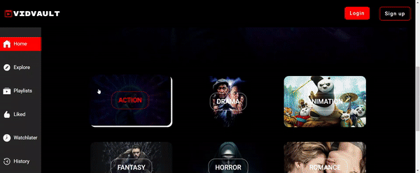

# VidVault - Your Ultimate Video Streaming Platform

VidVault is a comprehensive video streaming platform where you can watch a wide variety of movies of all types. With a highly mobile-responsive design, VidVault ensures that you can enjoy your favorite movies anytime, anywhere. Whether you're into action, comedy, drama, or documentaries, VidVault has something for everyone.

## Live Website

Check out our live website [here](https://video-library-frontend.vercel.app/) to start exploring and watching your favorite movies now!

## Watch the Video Demo

## Features

### Sidebar Navigation

- **Home:** Go back to the home page.
- **Explore:** Discover new movies through our explore page.
- **Watch History:** View your watch history.
- **Playlist:** Access your playlists.
- **Watch Later:** Quickly access videos you've saved to watch later.
- **Liked:** See the videos you've liked.

### Homepage

- Navigate to the video list page to discover new content.

### Explore Page

- **Filtering:** Easily find movies by category.
- **Watch Later:** Add videos to your watch later list.
- **Playlist:** Add videos to your playlists.

### Watch Later

- View and manage videos you've saved to watch later.

### Like

- View and manage videos you've liked.

### History

- View and manage your watch history.

### Playlist Feature

- Create and manage your playlists.

### Login and Sign Up

- Easily create an account or log in to access personalized features.

### Video Page

- **Like:** Like the video to save it to your liked videos.
- **Watch Later:** Save the video to watch later.
- **Description:** Read a brief description of the video.
- **Playlist:** Add the video to one of your playlists.
- **Share:** Share the video with friends and family.

## Contributing

We welcome contributions from the community! Whether it's bug fixes, feature enhancements, or feedback, we appreciate any help in making VidVault even better. Please refer to our [Contribution Guidelines](CONTRIBUTING.md) for more information.

## License

VidVault is licensed under the [MIT License](LICENSE).
